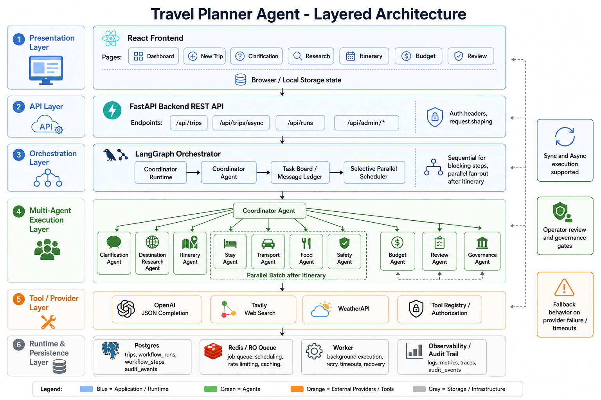
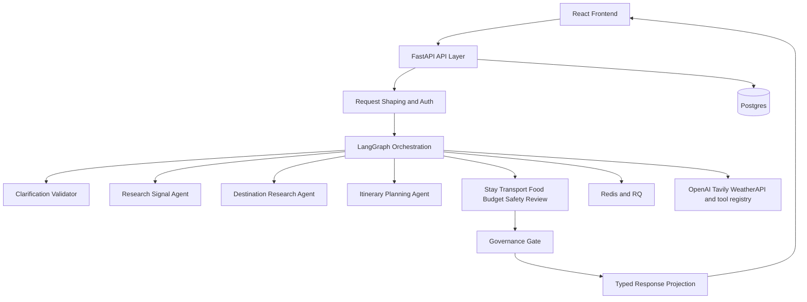

# AI Travel Planner

AI Travel Planner is a full-stack agentic trip-planning system with a React frontend, a FastAPI backend, a LangGraph-driven planning pipeline, Redis-backed async execution, and Postgres-backed persistence and auditability.

This repository is interesting for two reasons:

- it already works as a production-minded travel planning application
- it also shows how to evolve a sequential planner into a more disciplined multi-agent runtime

The architecture framing in this README is grounded in the codebase and informed by the source materials:

- `Engineering_Agentic_Systems.pdf`
- `Beyond_the_Prompt__Engineering_a_Commercial-Grade_Multi-Agent_A.mp4`

Those materials reinforce the same design message visible in this repo: an LLM is only one component inside a larger system built from contracts, orchestration, queues, persistence, and governance.

## Project Walkthrough Video

- [Project walkthrough video](docs/assets/beyond-the-prompt-project-walkthrough.mp4)

The video file is committed into the repo at `docs/assets/beyond-the-prompt-project-walkthrough.mp4`.

## What The Project Does

The application helps a traveler move from a raw request to a structured trip plan. The planner:

- validates whether the request is complete enough to run
- gathers destination research signals
- builds an itinerary
- recommends stay, transport, and food options
- assesses budget fit and safety considerations
- performs review and governance checks before returning the final plan

The system supports both:

- sync execution for immediate responses
- async execution for longer-running workflows backed by Redis/RQ workers

## Architecture At A Glance





## Why This Architecture Matters

The external PDF/video source material highlights several principles that this repository either already implements or is actively moving toward:

- `LLM != architecture`
  The system does not wrap one prompt in a thin UI. It uses typed request models, workflow state, audited runs, retries, and specialized planning steps.
- `Boundaries beat improvisation`
  The planner is partitioned into explicit responsibilities: API, orchestration, specialists, tooling, persistence, and infrastructure.
- `Durable state matters`
  The code distinguishes user-facing trips from execution runs, steps, and queue jobs so retries, observability, and async processing remain manageable.
- `Bounded delegation matters`
  The current implementation uses a deterministic graph today, and the repo also contains coordinator-runtime scaffolding for a future bounded multi-agent topology.

These ideas are not abstract here. They show up directly in the code.

## How The Project Is Built

### 1. Presentation Layer

The frontend lives in `frontend/` and is built with:

- React 18
- TypeScript
- React Router
- Create React App tooling

The UI exposes protected routes for:

- dashboard
- new trip
- clarification
- research
- itinerary
- budget
- review
- login and signup

The frontend does not invent its own domain model. It projects backend-generated planning artifacts into screens.

### 2. API and Request Boundary

The backend entrypoint is [backend/src/main.py](/Users/naveen.kumar.p/Documents/github control automation/AI-travel-Planner/backend/src/main.py). The main API router is [backend/src/api/main.py](/Users/naveen.kumar.p/Documents/github control automation/AI-travel-Planner/backend/src/api/main.py).

Important endpoints include:

- `GET /api/health`
- `GET /api/health/readiness`
- `GET /api/health/dependencies`
- `POST /api/auth/register`
- `POST /api/auth/login`
- `GET /api/auth/me`
- `POST /api/trips`
- `POST /api/trips/async`
- `POST /api/clarification/copilot`
- `GET /api/trips/{trip_id}`
- `GET /api/jobs/{job_id}`
- admin review and observability endpoints under `/api/admin/...`

This boundary layer is responsible for:

- CORS
- request logging
- request IDs
- actor extraction
- API-key enforcement when enabled
- rate limiting
- shaping responses back to the frontend

### 3. Orchestration Layer

The current runtime backbone is [backend/src/agents/travel_planner/graph.py](/Users/naveen.kumar.p/Documents/github control automation/AI-travel-Planner/backend/src/agents/travel_planner/graph.py).

Today the planner runs as a sequential LangGraph pipeline:

```text
START
  -> clarification_validator
  -> research_signal_agent
  -> destination_research_agent
  -> itinerary_planning_agent
  -> stay_recommendation_agent
  -> local_transport_agent
  -> food_recommendation_agent
  -> budget_optimization_agent
  -> solo_women_safety_advisor_agent
  -> review_and_consistency_agent
  -> governance_gate_agent
  -> END
```

The clarification step can short-circuit the workflow if the user input is still underdetermined. That matches one of the strongest themes from the PDF: never launch an expensive planning workflow on unstable intent.

### 4. Specialist Layer

The specialist logic lives in [backend/src/agents/travel_planner/nodes.py](/Users/naveen.kumar.p/Documents/github control automation/AI-travel-Planner/backend/src/agents/travel_planner/nodes.py).

The main planner nodes are:

- `ClarificationValidator`
- `ResearchSignalAgent`
- `DestinationResearchAgent`
- `ItineraryPlanningAgent`
- `StayRecommendationAgent`
- `LocalTransportAgent`
- `FoodRecommendationAgent`
- `BudgetOptimizationAgent`
- `SoloWomenSafetyAdvisorAgent`
- `ReviewAndConsistencyAgent`
- `GovernanceGateAgent`

These are not free-form chatting agents. They are bounded execution units operating over typed planner state.

### 5. Shared State, Contracts, and Governance

The state model is defined in:

- [backend/src/agents/travel_planner/state.py](/Users/naveen.kumar.p/Documents/github control automation/AI-travel-Planner/backend/src/agents/travel_planner/state.py)
- [backend/src/agents/travel_planner/schemas.py](/Users/naveen.kumar.p/Documents/github control automation/AI-travel-Planner/backend/src/agents/travel_planner/schemas.py)
- [backend/src/agents/travel_planner/contracts.py](/Users/naveen.kumar.p/Documents/github control automation/AI-travel-Planner/backend/src/agents/travel_planner/contracts.py)
- [backend/src/agents/travel_planner/governance.py](/Users/naveen.kumar.p/Documents/github control automation/AI-travel-Planner/backend/src/agents/travel_planner/governance.py)

This is one of the strongest production-grade qualities in the repo:

- each node reads typed inputs
- each node writes typed outputs
- node outputs are recorded into run summaries
- governance flags are recalculated as the workflow progresses
- audit events are appended at node start, completion, and fallback events

This matches the PDF’s emphasis on explicit contracts over implicit state.

### 6. Tooling and Provider Layer

External integrations are intentionally separated from planning orchestration.

Relevant modules include:

- [backend/src/providers/factory.py](/Users/naveen.kumar.p/Documents/github control automation/AI-travel-Planner/backend/src/providers/factory.py)
- [backend/src/providers/llm.py](/Users/naveen.kumar.p/Documents/github control automation/AI-travel-Planner/backend/src/providers/llm.py)
- [backend/src/providers/search.py](/Users/naveen.kumar.p/Documents/github control automation/AI-travel-Planner/backend/src/providers/search.py)
- [backend/src/providers/travel.py](/Users/naveen.kumar.p/Documents/github control automation/AI-travel-Planner/backend/src/providers/travel.py)
- [backend/src/agents/travel_planner/research_clients.py](/Users/naveen.kumar.p/Documents/github control automation/AI-travel-Planner/backend/src/agents/travel_planner/research_clients.py)
- [backend/src/agents/travel_planner/tooling/](/Users/naveen.kumar.p/Documents/github control automation/AI-travel-Planner/backend/src/agents/travel_planner/tooling)

The repo is designed to work with:

- OpenAI
- Tavily
- WeatherAPI
- optional travel/search providers exposed through the tooling layer

### 7. Persistence and Runtime Semantics

The PDF source emphasizes clear runtime nouns. This codebase already reflects that idea in practice.

The main semantics are:

- `Trip`
  The user-facing planning artifact
- `Run`
  One workflow execution attempt for a trip
- `Step`
  One observable stage within a run
- `Job`
  The queue-level execution handle for async processing

You can see those semantics in:

- [backend/src/services/workflow_runtime_service.py](/Users/naveen.kumar.p/Documents/github control automation/AI-travel-Planner/backend/src/services/workflow_runtime_service.py)
- [backend/src/domain/trips/](/Users/naveen.kumar.p/Documents/github control automation/AI-travel-Planner/backend/src/domain/trips)
- [backend/src/domain/workflows/](/Users/naveen.kumar.p/Documents/github control automation/AI-travel-Planner/backend/src/domain/workflows)
- [backend/src/domain/jobs/](/Users/naveen.kumar.p/Documents/github control automation/AI-travel-Planner/backend/src/domain/jobs)
- [backend/src/persistence/postgres/](/Users/naveen.kumar.p/Documents/github control automation/AI-travel-Planner/backend/src/persistence/postgres)

This separation is what makes async execution, retries, cancellation, reruns, and tracing manageable.

### 8. Async Execution Model

The repo supports two UX models:

- `POST /api/trips`
  Synchronous execution that blocks until a response is ready
- `POST /api/trips/async`
  Background execution routed through Redis/RQ workers

That split is implemented in [backend/src/services/workflow_runtime_service.py](/Users/naveen.kumar.p/Documents/github control automation/AI-travel-Planner/backend/src/services/workflow_runtime_service.py) and `docker-compose.yml`.

In Docker, the runtime is divided into:

- `frontend`
- `backend`
- `worker`
- `postgres`
- `redis`

### 9. Future Multi-Agent Direction

The repo is not only a working planner. It also contains the next-step architecture under:

- [backend/src/agents/travel_planner/multi_agent/runtime.py](/Users/naveen.kumar.p/Documents/github control automation/AI-travel-Planner/backend/src/agents/travel_planner/multi_agent/runtime.py)
- [backend/src/agents/travel_planner/multi_agent/coordinator.py](/Users/naveen.kumar.p/Documents/github control automation/AI-travel-Planner/backend/src/agents/travel_planner/multi_agent/coordinator.py)
- [backend/src/agents/travel_planner/multi_agent/schemas.py](/Users/naveen.kumar.p/Documents/github control automation/AI-travel-Planner/backend/src/agents/travel_planner/multi_agent/schemas.py)
- [backend/src/agents/travel_planner/multi_agent/topology.py](/Users/naveen.kumar.p/Documents/github control automation/AI-travel-Planner/backend/src/agents/travel_planner/multi_agent/topology.py)

This target direction replaces a fixed sequential graph with:

- a coordinator-owned ledger
- typed task assignments
- bounded delegation rules
- selective parallelism
- revision loops
- governance-aware handoffs

That progression lines up directly with the PDF’s contrast between a toy wrapper and a real agentic system.

## Repository Layout

```text
AI-travel-Planner/
  backend/                      FastAPI app, LangGraph runtime, persistence, workers
  frontend/                     React + TypeScript UI
  docs/                         Architecture and operations notes
  docs/assets/                  Images and project walkthrough video
  scripts/                      Local startup and PDF generation helpers
  docker-compose.yml            Full local stack
```

## Running The Project With Docker

### Prerequisites

- Docker Desktop running
- Docker Compose available through `docker compose`
- API keys for at least:
  - `OPENAI_API_KEY`
  - `TAVILY_API_KEY`
  - `WEATHERAPI_API_KEY`

### Option 1: Start With Docker Compose

1. Prepare backend environment values:

```bash
cd /Users/naveen.kumar.p/Documents/github\ control\ automation/AI-travel-Planner
cp backend/.env.dev.example backend/.env
```

2. Edit `backend/.env` and set your provider keys.

3. Start the stack:

```bash
docker compose up --build
```

4. Open the app:

- Frontend: `http://localhost:3000`
- Backend API: `http://localhost:8000`
- Backend health: `http://localhost:8000/api/health`

### Option 2: Use The Included Helper Script

The helper script:

- verifies Docker is running
- exports provider keys from `.env` when available
- starts the full stack
- waits for frontend and backend readiness
- opens the browser automatically

Run:

```bash
./scripts/start-local-stack.sh
```

### Docker Services

The Compose stack defined in [docker-compose.yml](/Users/naveen.kumar.p/Documents/github control automation/AI-travel-Planner/docker-compose.yml) starts:

- `postgres` on `5432`
- `redis` on `6379`
- `backend` on `8000`
- `worker` for background jobs
- `frontend` on `3000`

## Environment Configuration

The most useful example files are:

- [backend/.env.dev.example](/Users/naveen.kumar.p/Documents/github control automation/AI-travel-Planner/backend/.env.dev.example)
- [backend/.env.prod.example](/Users/naveen.kumar.p/Documents/github control automation/AI-travel-Planner/backend/.env.prod.example)

Important variables:

- `APP__ENVIRONMENT`
- `DATABASE__URL`
- `REDIS__URL`
- `SECURITY__ENABLED`
- `SECURITY__API_KEYS`
- `OPENAI_MODEL`
- `OPENAI_API_KEY`
- `TAVILY_API_KEY`
- `WEATHERAPI_API_KEY`
- `SERPAPI_API_KEY`
- `AVIATIONSTACK_API_KEY`

For local development, security is intentionally more permissive. For production, API-key enforcement and stricter secret posture are expected.

## How A Request Flows Through The System

1. A user signs in and submits a trip request from the React app.
2. FastAPI validates the request and establishes actor/request context.
3. The planner chooses sync or async execution.
4. The clarification validator checks whether the request is stable enough to continue.
5. The research and planning nodes generate typed artifacts.
6. Budget, safety, review, and governance stages assess plan quality and risk.
7. The response is projected back into frontend-friendly screens.
8. Audit events, workflow runs, and step traces remain queryable for operators.

## What Makes This Repo More Than A Demo

- It distinguishes product artifacts from runtime artifacts.
- It separates provider access from orchestration.
- It includes governance and operator-review concepts, not only generation.
- It supports background execution with Redis/RQ.
- It keeps a clear migration path from sequential workflow to coordinated multi-agent runtime.
- It documents the architecture with code, diagrams, and operations notes instead of relying on prompt magic.

## Additional Reading In This Repo

- [docs/architecture.md](/Users/naveen.kumar.p/Documents/github control automation/AI-travel-Planner/docs/architecture.md)
- [docs/agent-flow.md](/Users/naveen.kumar.p/Documents/github control automation/AI-travel-Planner/docs/agent-flow.md)
- [docs/true-multi-agent-architecture.md](/Users/naveen.kumar.p/Documents/github control automation/AI-travel-Planner/docs/true-multi-agent-architecture.md)
- [docs/operations/deployment.md](/Users/naveen.kumar.p/Documents/github control automation/AI-travel-Planner/docs/operations/deployment.md)
- [docs/operations/load-and-resilience.md](/Users/naveen.kumar.p/Documents/github control automation/AI-travel-Planner/docs/operations/load-and-resilience.md)
- [docs/operations/runbooks.md](/Users/naveen.kumar.p/Documents/github control automation/AI-travel-Planner/docs/operations/runbooks.md)

## License

This project is distributed under the license in [LICENSE](/Users/naveen.kumar.p/Documents/github control automation/AI-travel-Planner/LICENSE).
