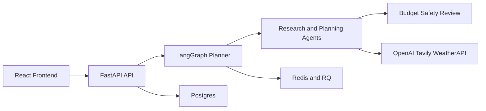

# AI Travel Planner

AI Travel Planner turns a rough travel idea into a structured trip plan with:

- destination research
- itinerary suggestions
- stay, transport, and food recommendations
- budget and safety review

It is built as an agentic workflow, but the experience is meant to stay simple: give the user a useful plan, not a wall of AI output.

## Travel Planner Architecture


https://github.com/user-attachments/assets/7e829083-217d-41b4-b140-54edd75654da


## What It Is

At a high level, the project combines:

- a React frontend for trip input and results
- a FastAPI backend for APIs and workflow execution
- a LangGraph-based planner for orchestration
- Redis + RQ for async jobs
- Postgres for persistence, audit trail, and workflow records

The attached PDF and video both point to the same idea: strong agentic products are software systems first. This repo follows that approach by using structure, persistence, contracts, and bounded workflow steps instead of pretending one prompt is the architecture.

## How It Works

The flow is simple:

1. The user submits a trip request in the frontend.
2. The backend validates the request.
3. A clarification step decides whether the input is complete enough to continue.
4. The planner runs research and recommendation steps in sequence.
5. The result is reviewed for budget, consistency, and safety.
6. The frontend renders the final trip plan.

## Architecture




## Main Parts

### Frontend

The frontend in `frontend/` handles:

- login and signup
- new trip creation
- clarification flow
- research, itinerary, budget, and review screens

### Backend

The backend in `backend/` handles:

- API routing
- authentication and request shaping
- orchestration of the planner
- sync and async execution
- audit logging and observability

### Planner

The planner is a staged workflow, not uncontrolled agent chat.

Main steps:

- clarification
- research signal generation
- destination research
- itinerary planning
- stay recommendation
- local transport recommendation
- food recommendation
- budget optimization
- solo women safety review
- final consistency and governance check

That design is intentional. It keeps the system understandable, testable, and easier to debug.

### Async Runtime

The project supports two execution modes:

- `POST /api/trips` for direct responses
- `POST /api/trips/async` for background execution through Redis/RQ

This gives the product a fast path for direct responses and a background path for heavier runs.

## Repo Structure

```text
AI-travel-Planner/
  backend/              FastAPI app, planner runtime, persistence, workers
  frontend/             React app
  docs/                 architecture and operations notes
  docs/assets/          walkthrough video and diagrams
  scripts/              helper scripts
  docker-compose.yml    local full-stack startup
```

## Run Locally With Docker

### Prerequisites

- Docker Desktop
- `docker compose`
- API keys for:
  - `OPENAI_API_KEY`
  - `TAVILY_API_KEY`
  - `WEATHERAPI_API_KEY`

### Setup

From the project root:

```bash
cp backend/.env.dev.example backend/.env
```

Then edit `backend/.env` and add your API keys.

### Start

```bash
docker compose up --build
```

Or use the helper script:

```bash
./scripts/start-local-stack.sh
```

### Local URLs

- Frontend: `http://localhost:3000`
- Backend: `http://localhost:8000`
- Health check: `http://localhost:8000/api/health`

## Services

The compose stack starts:

- `frontend`
- `backend`
- `worker`
- `postgres`
- `redis`

## Why It Is Interesting

This repo is useful if you want to study how to build an agentic product without turning the whole system into prompt spaghetti.

What it does well:

- clear separation between UI, API, orchestration, tools, and storage
- bounded workflow steps instead of free-form agent chaos
- support for both sync and async execution
- production-minded pieces like audit trails, job tracking, and persistence


